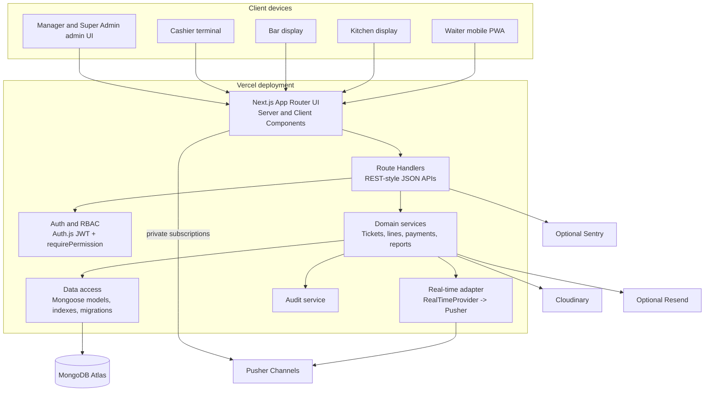

# Container Diagram

## Purpose

This document describes the deployable and logical containers inside the Restaurant Order Management System. The implementation is a single Next.js 15 modular monolith deployed primarily to Vercel, with external managed services for database, real-time events, media, and optional notifications/monitoring.

## Container View



## Logical Containers

| Container | Runtime location | Responsibilities | Key rules |
|---|---|---|---|
| Next.js App Router UI | Vercel frontend/server rendering | Persona route groups, layouts, forms, table floor, order composer, KDS, BDS, cashier, admin, reports. | Must not import Mongoose models or server secrets. Must use feature hooks/server actions/API clients. |
| Route Handlers | Vercel serverless functions using Node.js runtime where database access is required | JSON API boundary, authentication, authorization, Zod validation, response envelope. | Must call domain services for business operations. Must not calculate totals or route stations directly. |
| Authentication and RBAC | Server-side modules | Auth.js credential authentication, JWT sessions, session freshness, effective permission union, permission guards. | Must never authorize by hard-coded role names. |
| Domain Services | Server-side modules | Open ticket, fire lines, status changes, close ticket, payment, receipts, reports, settings, audit orchestration. | Must enforce invariants and use server-derived prices, stations, totals, and permissions. |
| Data Access | Server-side modules | MongoDB connection, Mongoose schemas, indexes, projections, migrations, seed data. | Must keep database access out of UI and use indexes for hot paths. |
| Real-Time Provider | Server-side interface plus Pusher adapter | Publish compact events after successful writes; authorize channel subscriptions. | Domain services depend on interface, not Pusher SDK. Events are not authoritative. |
| Audit Service | Server-side modules | Persist audit evidence for sensitive actions. | Must redact secrets, tokens, passwords, PINs, and payment card data. |

## Required Source Boundaries For Guide 04

These boundaries must be created when the application is scaffolded directly in the project root:

```text
src/app/                 Pages, layouts, and route handlers
src/components/          Reusable UI only
src/features/            Persona and feature-specific UI
src/server/auth/         Authentication and session helpers
src/server/rbac/         Permission calculation and guards
src/server/db/           Connection, models, indexes, migrations
src/server/services/     Business operations
src/server/realtime/     Provider interface and adapters
src/shared/contracts/    Zod schemas, enums, DTOs, event contracts
src/shared/money/        Minor-unit helpers
src/shared/errors/       Typed application errors
```

## API Boundary Pattern

Every Route Handler follows the same sequence:

1. Authenticate the request.
2. Authorize with one or more permissions.
3. Parse and validate route params, query strings, and request body with Zod.
4. Call one domain service.
5. Return the standard success or error response envelope.

Forbidden in Route Handlers:

- Calculating ticket totals.
- Deciding station routing.
- Performing status transition logic directly.
- Trusting client prices, station IDs, permissions, totals, or status transitions.
- Publishing real-time events before persistence succeeds.

## Main Data Flow Examples

### Open Ticket

```text
Waiter UI -> POST /api/tickets -> auth/RBAC -> openTicketForTable service -> MongoDB transaction/guard -> audit -> table/ticket response -> optional real-time table event
```

Controls:

- `order:create` permission.
- Active table validation.
- Partial unique index or equivalent guard for one OPEN ticket per table.
- Server-generated sequential ticket number.

### Fire Order Lines

```text
Waiter UI -> POST /api/tickets/:id/lines -> auth/RBAC -> Zod -> fireOrderLines service -> batch menu lookup -> snapshots -> batch line insert -> total update -> station events -> authoritative response
```

Controls:

- `order:update` permission.
- Ticket must be OPEN.
- Menu item and modifier validation.
- Server-resolved station assignment.
- Integer minor-unit calculations.
- Duplicate-submission protection.

### Station Status Update

```text
KDS/BDS UI -> PATCH /api/lines/:id/status -> auth/RBAC -> line lookup -> station-scoped permission -> transition service -> MongoDB update -> READY/table event -> compact response
```

Controls:

- Required permission derived from stored line station type.
- Legal transition map.
- Optimistic concurrency or version checks.
- READY notifications sent only to relevant waiter/table context.

### Payment

```text
Cashier UI -> POST /api/tickets/:id/pay -> auth/RBAC -> settleTicket service -> idempotency record -> load CLOSED ticket and snapshots -> calculate bill -> create payment -> mark PAID -> release table -> audit -> receipt data -> real-time events
```

Controls:

- `payment:create` permission.
- Ticket must be CLOSED.
- Idempotency key required.
- Atomic or transaction-safe payment and table release workflow.
- Receipt uses snapshots, not current menu data.

## Private Real-Time Channels

| Channel | Subscribers | Purpose | Authorization |
|---|---|---|---|
| `private-station-<stationId>` | Kitchen or Bar station clients | New line and line status notifications for a station. | Session plus station-scoped `line:read:*` permission matching the station type. |
| `private-table-<tableId>` | Waiter context for a table | Ticket updates and READY notifications. | Session plus table/ticket access. |
| `private-cashier` | Cashier clients | Newly closed and paid ticket updates. | `payment:create` or cashier queue permission when defined. |
| `private-admin` | Manager and Super Admin admin contexts | Operational/admin notifications. | Relevant admin/report/audit permissions. |
| `private-user-<userId>` | One authenticated staff user | Permission refresh and personal alerts. | User ID must match authenticated session. |

## Performance Controls By Container

| Container | Controls |
|---|---|
| UI | Role-aware route groups, code splitting, minimal client components, TanStack Query cache invalidation, Zustand only for draft/local workflow state, optimized images, skeletons over full-screen spinners. |
| API | Zod validation once, compact DTOs, bounded query params, request IDs, consistent response envelope. |
| Services | Batch reads/writes, idempotency records, atomic updates, server timing instrumentation, no N+1 station routing. |
| Data access | Required indexes, projections, lean reads, cursor pagination, migration ledger. |
| Real-time | Small events, publish after write, versioned event names, reconnect reconciliation, no global broadcasts when scoped channels are sufficient. |

## Reliability Controls By Container

| Container | Controls |
|---|---|
| UI | Offline/reconnecting banners, retry actions, reconciliation after reconnect, disabled duplicate taps for mutations, confirmation dialogs for destructive actions. |
| API | Auth required by default, permission-denied responses, validation errors with plain-language messages, idempotency conflict handling. |
| Services | Legal transition maps, payment idempotency, duplicate open-ticket protection, duplicate fire protection, audit evidence, transaction-safe payment release. |
| Data access | Unique indexes, partial indexes, TTL idempotency records, migration scripts, backup-aware operations. |
| Real-time | Subscription authorization, stale event detection, compact payloads, future outbox option for publish failures. |

## Internal References

- Domain lifecycle: `../domain/order-lifecycle.md`
- Business invariants: `../domain/invariants.md`
- Next.js monolith ADR: `../adr/0001-nextjs-monolith.md`
- Permission-based RBAC ADR: `../adr/0002-permission-based-rbac.md`
- Real-time provider ADR: `../adr/0003-realtime-provider.md`
- Money minor-units ADR: `../adr/0004-money-minor-units.md`

## Guide 03 Exit Criteria Mapping

| Criterion | Documented by |
|---|---|
| No feature depends directly on Pusher from React presentation components. | Real-time provider boundary and dependency rules. |
| No feature depends directly on Mongoose models from React presentation components. | UI, route handler, service, and data-access boundaries. |
| No feature depends directly on Auth.js from React presentation components. | Auth/RBAC server boundary and safe session view-state rule. |
| Dependencies pass through typed feature hooks or server services. | Required source boundaries and API boundary pattern. |
