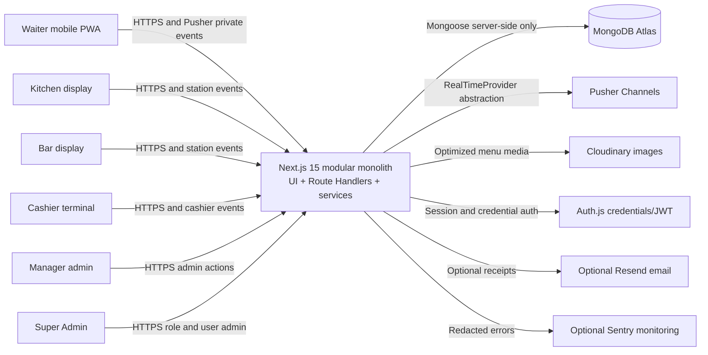

# System Context

## Purpose

This document defines the high-level system context for the Restaurant Order Management System. It describes the actors, external services, application responsibilities, and architecture rules that future implementation guides must preserve.

## Architecture Summary

The system is a full-stack modular monolith built with Next.js 15 App Router and TypeScript. It serves persona-specific React interfaces and REST-style Route Handlers from one codebase. MongoDB Atlas stores authoritative business state through Mongoose models. Auth.js provides staff authentication with JWT sessions. Permission-based RBAC governs all protected actions. Pusher Channels is the initial real-time provider because Vercel serverless functions do not provide a reliable native long-lived Socket.IO server.

Database state is authoritative. Real-time events are small notifications that tell clients to update or re-fetch state; they never replace server-side validation or persistence.

## Approved Technical Baseline

| Concern | Decision |
|---|---|
| Framework | Next.js 15 App Router. |
| Language | TypeScript. |
| Architecture style | Full-stack modular monolith. |
| Database | MongoDB Atlas with Mongoose. |
| Authentication | Auth.js credential authentication with JWT sessions. |
| Authorization | Permission-based RBAC with multi-role union. |
| Validation | Zod schemas shared between server and UI contracts. |
| Server state | TanStack Query for client-side server-state management. |
| Local UI workflow state | Zustand only for minimal transient state such as unsent order drafts. |
| UI system | Tailwind CSS, shadcn/ui, and touch-optimized responsive components. |
| Waiter device target | Mobile-first PWA. |
| Station and cashier target | Large touch targets for Kitchen, Bar, and Cashier station interfaces. |
| Money | Integer minor units only, with order-line name and price snapshots. |
| Real-time | Pusher Channels through a `RealTimeProvider` abstraction. |
| Deployment | Vercel as the primary application target. |
| Auditability | Audit logs for sensitive business actions. |

## Project Root Decision

The application root is `/Users/lahiruharshana/Document/MY/restaurant-system`. During Guide 04, scaffold the Next.js application directly inside this current root. Do not create a nested `restaurant-roms` directory. Preserve the existing `docs/` directory. Do not modify, stage, delete, or commit anything outside the `restaurant-system` directory.

## System Actors

| Actor | Primary device | Primary responsibilities | Required architectural support |
|---|---|---|---|
| Waiter | Mobile phone or PWA | Open and resume tables, add order lines, fire orders, receive READY alerts, mark served, close tickets. | Mobile-first UI, fast table and ticket APIs, local draft state, real-time table/user notifications, server-side permission checks. |
| Kitchen staff | Tablet or station display | View and advance Kitchen lines from NEW to PREPARING to READY. | Touch-optimized KDS, station-scoped queue API, Kitchen-only permissions, compact real-time notifications. |
| Bar staff | Tablet or station display | View and advance Bar lines from NEW to PREPARING to READY. | Touch-optimized BDS, station-scoped queue API, Bar-only permissions, compact real-time notifications. |
| Cashier | Tablet or desktop terminal | View CLOSED tickets, settle payment, produce receipts, release tables after payment. | Cashier queue, idempotent payment service, receipt data from snapshots, audit logging. |
| Manager | Desktop or tablet | Manage operational settings, menu, tables, reports, voids, cancellations, and review audit records. | Admin shell, permission gates, audited destructive actions, report queries with bounds and indexes. |
| Super Admin | Desktop | Manage users, roles, permissions, and emergency administrative access. | Permission catalog, multi-role assignment, effective permission calculation, role-change invalidation and audit logs. |

## External Services

| Service | Role in system | Boundary rule |
|---|---|---|
| MongoDB Atlas | Authoritative data store for users, roles, permissions, menu, tables, tickets, order lines, payments, settings, audit logs, idempotency records, and migrations. | Access only through server-side data-access modules and domain services. UI never imports Mongoose or connects to MongoDB. |
| Pusher Channels | Initial real-time provider for private station, table, cashier, admin, and user channels. | Domain services publish through a `RealTimeProvider` interface only. No domain service calls the Pusher SDK directly. |
| Cloudinary | Optional menu image storage and transformation. | Server-controlled upload and optimized image references. Operational screens must remain usable without images. |
| Auth.js | Credential authentication and JWT session management. | Auth session helpers live under server auth boundaries. UI receives only safe session and permission-derived view state. |
| Resend | Optional email receipts or operational notifications. | Non-critical email failures must not roll back successful payment. No secrets in client code. |
| Sentry | Optional error monitoring. | Redact secrets, passwords, PINs, tokens, and payment details before reporting. |

## System Context Diagram

## Application Boundaries

| Boundary | Responsibility | Must not do |
|---|---|---|
| UI layer | Render persona-specific screens, collect input, show loading, empty, error, offline, success, and permission-denied states. | Must not connect to MongoDB, call Mongoose models, calculate authoritative totals, decide station routing, or bypass server permissions. |
| Route-handler/API layer | Authenticate, authorize, parse and validate input with Zod, call one domain service, return the standard response envelope. | Must not contain business workflows such as totals calculation, station routing, payment settlement, or status transition rules. |
| Authentication and authorization layer | Auth.js credential login, JWT sessions, current-user checks, effective permission calculation, permission guards. | Must not authorize by hard-coded role-name comparisons. |
| Domain/service layer | Enforce business invariants, state transitions, idempotency, totals, station routing, table occupancy, payment settlement, and audit calls. | Must not import React components or rely on client-submitted prices, totals, permissions, or station IDs. |
| Data-access layer | Mongoose connection, models, indexes, projections, migrations, and persistence helpers. | Must not contain UI logic or permission-display rules. |
| Real-time event layer | Publish small events after successful database writes and authorize private subscriptions. | Must not become the source of truth or publish before persistence succeeds. |
| Audit layer | Record sensitive business actions, actor IDs, entity IDs, safe metadata, reasons, request IDs, and timestamps. | Must not store passwords, PINs, tokens, full payment card details, or unnecessary personal data. |

## Main Modules

| Module | Purpose | Primary dependencies |
|---|---|---|
| Authentication | Staff login, password/PIN verification, session lifecycle. | Auth.js, user model, password/PIN helpers, audit. |
| Users | Staff profiles, active state, role assignments. | User model, role model, permission guard, audit. |
| Roles and permissions | Permission catalog, multi-role union, role editing, cache invalidation. | Role and permission models, RBAC services, real-time permission-change events. |
| Stations | Kitchen, Bar, and custom station management. | Station model, menu references, station-scoped authorization. |
| Menu | Categories, items, modifiers, availability, station assignment, image references. | Menu models, station model, money helpers, Cloudinary. |
| Tables | Zones, active tables, occupancy, current ticket pointer. | Table model, ticket service, real-time table events. |
| Tickets | Ticket lifecycle OPEN, CLOSED, PAID, CANCELLED. | Ticket model, order-line model, payment service, audit. |
| Order lines | Fired line snapshots, station routing, status transitions, voids. | Menu item model, station model, order-line model, transition rules, real-time. |
| Kitchen Display System | Kitchen queue and status actions. | Station queue API, `line:read:kitchen`, `line:status:kitchen`, real-time. |
| Bar Display System | Bar queue and status actions. | Station queue API, `line:read:bar`, `line:status:bar`, real-time. |
| Cashier and payments | CLOSED ticket queue, settlement, idempotent payments, table release. | Ticket, payment, table, idempotency, money, audit, receipt. |
| Receipts | Stable receipt data, print view, PDF and optional email. | Ticket snapshots, order-line snapshots, payment record, restaurant settings. |
| Reports | Sales, items, waiter, payment method, preparation duration, void/cancel summaries. | Bounded aggregation queries, indexes, projections, audit permissions. |
| Audit logs | Accountability for sensitive actions. | Audit model, request context, actor context. |
| Real-time notifications | Station, table, cashier, admin, and user events. | RealTimeProvider interface, Pusher adapter, subscription authorization. |

## Dependency Rules

| ID | Rule |
|---|---|
| DR-001 | UI must not access MongoDB or Mongoose directly. |
| DR-002 | UI must not call Pusher SDK APIs for server-side publish operations. |
| DR-003 | UI may subscribe to authorized private channels through client hooks, then reconcile with REST state. |
| DR-004 | Route handlers authenticate, authorize, validate, call one domain service, and return the standard response envelope. |
| DR-005 | Domain services enforce invariants from `docs/domain/order-lifecycle.md` and `docs/domain/invariants.md`. |
| DR-006 | Database models contain persistence schema and indexes, not UI logic. |
| DR-007 | Real-time publishing occurs only after successful state changes. |
| DR-008 | Clients cannot bypass server-side permission checks. Hidden buttons are usability, not security. |
| DR-009 | Payment and order submission idempotency must be implemented in server services, not only in UI. |
| DR-010 | Money helpers centralize integer minor-unit arithmetic and formatting. |

## Performance Architecture

| Area | Requirement |
|---|---|
| Database access | Prevent N+1 queries, use MongoDB indexes based on access patterns, use projections and lean reads for read-only hot paths, and avoid broad populate calls in waiter, station, and cashier flows. |
| Order firing | Batch menu item reads and order-line creation; resolve all stations without per-item database loops. |
| Real-time | Keep payloads small with IDs, status, timestamps, versions, and correlation IDs; clients re-fetch authoritative state. |
| Reference data | Cache stable menu categories, stations, and restaurant settings safely with explicit invalidation or short stale windows. |
| Growing datasets | Paginate users, tickets, cashier queues, audit logs, reports, and station queues where size may grow. |
| Client code | Use role-aware route groups and code splitting so waiter screens do not load admin, report, or receipt-generation bundles unnecessarily. |
| Images | Use optimized thumbnails for menu images; station displays must avoid unnecessary photography. |
| Interaction goals | Waiter first useful screen under 2.5 seconds after authentication, primary tap feedback under 100ms perceived, common API mutation p95 under 500ms excluding cold starts, and indexed database query p95 under 100ms under normal load testing. |

## Reliability Architecture

| Risk | Architectural control |
|---|---|
| Duplicate open tickets | Atomic open-ticket service plus database unique/partial index. |
| Duplicate order submission | Client mutation ID and server idempotency record for fire operations. |
| Duplicate payment | Payment idempotency key, unique/logical payment guards, and status lookup after timeout. |
| Missed real-time event | Reconnected clients re-fetch authoritative REST state and ignore stale event versions. |
| Invalid status transition | Server-side transition validation for tickets and order lines. |
| Payment/table mismatch | Payment record, ticket PAID transition, paid timestamp, and table release occur in one transaction or transaction-safe workflow with logical guards. |
| Publish failure after write | Database remains authoritative; add outbox or retry strategy in real-time guide if needed. |
| Permission changes while online | Server checks current effective permissions on each protected request and clients refresh authorization when notified. |

## Architecture Exit Criteria

- Feature UI does not depend directly on Pusher, Mongoose models, or Auth.js implementation details.
- React presentation components receive data from typed feature hooks or server boundaries.
- Route handlers remain thin and delegate business logic to services.
- Domain services own business invariants, money, station routing, state transitions, idempotency, and audit calls.
- The real-time provider is abstracted behind an application interface.
- The architecture does not contradict `docs/domain/order-lifecycle.md` or `docs/domain/invariants.md`.
