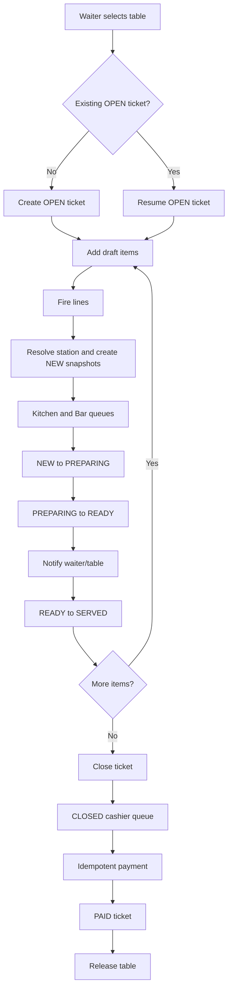

# Order Lifecycle

## Purpose

This document defines the required business lifecycle for restaurant tickets and order lines. It is the source of truth for developers and AI coding agents before any database model, API route, service, or screen is implemented.

## Scope

This document covers the first-release table-service workflow:

- A waiter opens or resumes a table ticket.
- The waiter adds menu items, quantities, modifiers, and notes.
- The system fires order lines to the correct preparation stations.
- Kitchen and Bar users process only their own lines.
- READY lines notify the correct waiter and table.
- The waiter marks delivered lines as SERVED.
- Additional rounds may be added while the ticket remains OPEN.
- The waiter closes the ticket.
- The cashier settles payment.
- The table is released only after successful payment.

Out of scope for the first release: split bills, table merging, table transfer, guest QR ordering, loyalty, inventory deduction, multi-branch tenancy, and kitchen printer hardware.

## Core Terms

| Term | Definition |
|---|---|
| Ticket | The whole order and bill for one table visit. |
| Order line | One ordered menu item tracked independently through preparation and service. |
| Fire | Submit one or more order lines to their assigned preparation stations. |
| Station | A preparation area such as Kitchen or Bar. |
| Round | A group of lines fired together on the same OPEN ticket. |
| Snapshot | Frozen item data copied to the order line when it is fired. |
| Authoritative state | The current state stored in the database after server-side validation. |

## Actors And Permission Matrix

Authorization must be permission-based. Role names are examples of common assignments, not authorization checks.

| Actor | Typical permissions | May perform |
|---|---|---|
| Super Admin | All permissions | Manage roles, permissions, users, menu, tables, reports, audit logs, and operational overrides. |
| Manager | `menu:manage`, `table:manage`, `report:view`, `audit:view`, `line:void`, `ticket:cancel` | Configure operations, review reports, void lines, and cancel tickets with reasons. |
| Waiter | `table:read`, `order:create`, `order:update`, `order:close` | View tables, open tickets, add lines, mark READY lines served when allowed by the service policy, and close tickets. |
| Kitchen | `line:read:kitchen`, `line:status:kitchen` | View and advance Kitchen lines only. |
| Bar | `line:read:bar`, `line:status:bar` | View and advance Bar lines only. |
| Cashier | `payment:create`, `receipt:print` | View closed tickets, settle payments, and generate receipts. |
| Multi-role user | Union of all assigned role permissions | Use every function permitted by the combined permission set. |

## Complete Restaurant Order Workflow

### BR-001: Select Table

The waiter starts from a floor view and selects a table.

Preconditions:

- The waiter is authenticated.
- The waiter has `table:read`.
- The table is active.

Rules:

- If the table has no OPEN ticket, the waiter may start a new ticket workflow.
- If the table already has an OPEN ticket, the waiter resumes the existing ticket after server validation.
- Table state shown in the UI is informational; the server must verify current table and ticket state.

### BR-002: Open Or Resume Ticket

The system creates or loads exactly one OPEN ticket for the table.

Preconditions for opening:

- Actor has `order:create`.
- Table is active.
- No OPEN ticket already exists for the table.
- Guest count is valid when required by the UI.

Side effects for opening:

- A new ticket is created with status `OPEN`.
- The ticket is bound to the table and waiter.
- The table is marked occupied with `currentTicketId`.
- A sequential ticket number is allocated by the server.
- Audit evidence is recorded when policy requires it.

Resume behavior:

- If an OPEN ticket already exists, the existing ticket is returned.
- A concurrent open attempt must not create a duplicate ticket.

### BR-003: Add Draft Items

The waiter builds a local draft for an OPEN ticket.

Rules:

- Draft lines may include menu item, quantity, selected modifiers, and a note.
- Quantity must be a positive valid integer.
- Client-displayed totals are estimates only.
- The client must not be trusted for price, station, final totals, permissions, or status transitions.

### BR-004: Fire Lines To Stations

The waiter submits draft lines to the server for an OPEN ticket.

Preconditions:

- Actor has `order:update`.
- Ticket status is `OPEN`.
- Each requested menu item exists and is available.
- Modifier selections satisfy menu rules.
- The request includes duplicate-submission protection when implemented by later guides.

Server processing rules:

- Load all referenced menu items in batch where possible.
- Resolve the station from the stored menu item, never from the client request.
- Copy name, price, modifier, and station snapshots onto each order line.
- Store monetary values in integer minor units.
- Create each order line with status `NEW`.
- Recalculate ticket totals from valid non-VOID line snapshots and approved adjustments.

Side effects:

- NEW lines are persisted.
- Station-specific real-time events are published after the database write succeeds.
- The waiter receives authoritative ticket totals after submission.
- The local draft is cleared only after server acknowledgement.

### BR-005: Station Processing

Kitchen and Bar staff process only the lines assigned to their station type.

Rules:

- Kitchen staff may read and update Kitchen lines only.
- Bar staff may read and update Bar lines only.
- Station status changes must be legal transitions.
- A station user cannot change ticket status.
- Duplicate taps must not advance a line more than one valid transition.

### BR-006: READY Notification

When a station marks a line READY, the correct waiter and table are notified.

Rules:

- The notification must identify the table and item.
- The notification must be persistent enough for operational use; a transient toast alone is insufficient.
- The waiter client must reconcile by re-fetching authoritative state.
- A READY event cannot itself authorize a SERVED transition; the server must validate the later request.

### BR-007: Mark Served

The waiter marks READY lines as SERVED after delivery to the guest.

Preconditions:

- Ticket is accessible to the waiter.
- Line status is `READY`.
- Actor has `order:update` and may access the ticket.
- The transition `READY -> SERVED` is legal.

Side effects:

- Line status becomes `SERVED`.
- `servedAt` or equivalent audit timestamp is stored when implemented.
- The live ticket view updates from authoritative state.

### BR-008: Add Additional Rounds

Guests may order more while the ticket is OPEN.

Rules:

- Additional rounds use the same fire-to-station workflow as the first round.
- New lines are added to the same OPEN ticket.
- New lines create a new fired round or fired timestamp group.
- Additional rounds are forbidden once the ticket is CLOSED, PAID, or CANCELLED.

### BR-009: Close Ticket

The waiter closes the ticket when guests are finished ordering.

Preconditions:

- Actor has `order:close`.
- Ticket status is `OPEN`.
- The server applies the configured policy for unfinished lines.
- The close action is confirmed in the UI.

Side effects:

- Ticket status becomes `CLOSED`.
- No new order lines may be added.
- Final pre-payment totals are recalculated server-side.
- A ticket-closed event is sent to the cashier queue after the database write succeeds.
- The table remains occupied.

### BR-010: Cashier Settlement

The cashier settles a CLOSED ticket.

Preconditions:

- Actor has `payment:create`.
- Ticket status is `CLOSED`.
- Payment request is idempotent.
- Discounts, service charge, tax, tendered amount, and change are calculated or validated server-side.

Side effects:

- A payment record is created.
- Ticket status becomes `PAID`.
- Paid timestamp is stored.
- Table is released and `currentTicketId` is cleared.
- Receipt data is generated from snapshots.
- Audit evidence is recorded.
- Real-time events notify relevant clients that the ticket is paid and the table is free.

## Ticket States

| State | Meaning | Entry point | Allows new lines | Allows payment |
|---|---|---|---:|---:|
| `OPEN` | Active table ticket. | Ticket creation. | Yes | No |
| `CLOSED` | Ordering is finished and the ticket awaits cashier settlement. | Waiter closes ticket. | No | Yes |
| `PAID` | Ticket is settled and table is released. | Successful cashier payment. | No | No |
| `CANCELLED` | Ticket was voided before payment or cancelled by authorized override. | Authorized cancellation. | No | No |

## Order-Line States

| State | Meaning | Entry point | Usual owner |
|---|---|---|---|
| `NEW` | Fired to station and waiting to start. | Server creates fired line. | Kitchen or Bar |
| `PREPARING` | Station has started making the item. | Station starts line. | Kitchen or Bar |
| `READY` | Item is ready for pickup. | Station marks ready. | Waiter pickup |
| `SERVED` | Item has been delivered to the guest. | Waiter marks served. | Waiter |
| `VOID` | Line is cancelled with a reason and audit record. | Authorized void. | Waiter or Manager policy |

## Ticket Transition Table

| ID | Transition | Permission | Preconditions | Side effects |
|---|---|---|---|---|
| TT-001 | None -> `OPEN` | `order:create` | Active table; no existing OPEN ticket; valid guest count when required. | Create ticket, assign ticket number, bind table and waiter, mark table occupied. |
| TT-002 | `OPEN` -> `CLOSED` | `order:close` | Ticket is OPEN; close policy passes; UI confirmation shown. | Block further lines, set closed timestamp, recalculate totals, notify cashier. |
| TT-003 | `CLOSED` -> `PAID` | `payment:create` | Ticket is CLOSED; payment request is valid and idempotent. | Create payment, set paid timestamp, release table, generate receipt data, audit payment. |
| TT-004 | `OPEN` -> `CANCELLED` | `ticket:cancel` | Actor has permission; reason supplied; cancellation policy passes. | Cancel ticket, keep audit record, resolve table according to cancellation policy. |
| TT-005 | `CLOSED` -> `CANCELLED` | `ticket:cancel` with elevated policy | Actor has elevated permission; reason supplied; no payment exists. | Cancel ticket with audit record and manager/admin accountability. |

## Order-Line Transition Table

| ID | Transition | Permission | Preconditions | Side effects |
|---|---|---|---|---|
| LT-001 | None -> `NEW` | `order:update` | Ticket is OPEN; menu item is available; station resolved from item; snapshots created. | Persist line, update totals, notify assigned station. |
| LT-002 | `NEW` -> `PREPARING` | `line:status:kitchen` or `line:status:bar` | Actor has permission matching stored station type; line is NEW. | Set status, store start timestamp when implemented, publish status update. |
| LT-003 | `PREPARING` -> `READY` | `line:status:kitchen` or `line:status:bar` | Actor has permission matching stored station type; line is PREPARING. | Set READY, store ready timestamp, notify waiter/table. |
| LT-004 | `READY` -> `SERVED` | `order:update` | Actor can access ticket; line is READY. | Set SERVED, store served timestamp, update live ticket. |
| LT-005 | `NEW` -> `VOID` | `line:void` | Reason supplied; actor has permission; line is not already served. | Exclude from active totals according to billing policy, write audit record. |
| LT-006 | `PREPARING` -> `VOID` | `line:void` | Reason supplied; actor has permission; station and operational policy allow void. | Exclude from active totals according to billing policy, notify station/table, write audit record. |
| LT-007 | `READY` -> `VOID` | `line:void` | Reason supplied; actor has permission; item has not been served. | Exclude from active totals according to billing policy, notify waiter/station, write audit record. |

## Forbidden Transitions

| ID | Forbidden action | Reason |
|---|---|---|
| FT-001 | `PAID` -> `OPEN` | A paid ticket is financially settled and immutable in normal operations. |
| FT-002 | `CLOSED` -> `OPEN` without an explicitly approved reopen workflow | Reopening affects cashier handoff, totals, audit, and table state. No first-release reopen workflow exists. |
| FT-003 | `CANCELLED` -> `OPEN` | Cancelled tickets cannot be reused through normal operations. |
| FT-004 | `CANCELLED` -> `PAID` | Cancelled tickets are not payable in normal operations. |
| FT-005 | `PAID` -> `CANCELLED` through normal cancellation | Refund or reversal requires a separately approved controlled workflow. |
| FT-006 | Adding lines to `CLOSED`, `PAID`, or `CANCELLED` tickets | Only OPEN tickets accept new order lines. |
| FT-007 | `READY` -> `NEW` | Reverse station transitions would corrupt preparation history. |
| FT-008 | `SERVED` -> `PREPARING` | Served items cannot return to preparation state. |
| FT-009 | `NEW` -> `READY` unless a documented fast-track override is approved | Skipping PREPARING removes operational traceability. |
| FT-010 | `PREPARING` -> `SERVED` | Waiter pickup and READY notification must occur first. |
| FT-011 | `VOID` -> any active line status | Voided lines are terminal in the first release. |

## Station Routing Rules

| ID | Rule |
|---|---|
| SR-001 | Every menu item must be assigned to a preparation station before it can be ordered. |
| SR-002 | The server resolves `stationId` from the stored menu item when the line is fired. |
| SR-003 | The client must not submit or override the authoritative station assignment. |
| SR-004 | The station ID and station type are snapshotted on the order line. |
| SR-005 | Kitchen users may process only lines whose stored station type requires Kitchen permission. |
| SR-006 | Bar users may process only lines whose stored station type requires Bar permission. |
| SR-007 | A single ticket may contain lines routed to multiple stations. |
| SR-008 | Station screens must fetch authoritative queues and use real-time events only as update signals. |

## Real-Time Business Events

Real-time events are operational notifications, not the source of truth. The database write must succeed before an event is published.

| ID | Event | Trigger | Recipients | Minimum payload |
|---|---|---|---|---|
| RT-001 | New line sent to station | Order lines are fired and persisted. | Assigned station channel. | Ticket ID, line IDs, station ID, table label, fired timestamp, version. |
| RT-002 | Line status updated | Legal line transition is persisted. | Relevant station, table, waiter, or admin channels as applicable. | Line ID, status, version, timestamp. |
| RT-003 | READY notification sent | Line becomes READY. | Correct waiter/table channel. | Line ID, ticket ID, table label, item name snapshot, timestamp. |
| RT-004 | Ticket closed and sent to cashier | Ticket becomes CLOSED. | Cashier channel. | Ticket ID, ticket number, table label, total, closed timestamp. |
| RT-005 | Ticket paid and table released | Payment succeeds. | Cashier, table, admin, and waiter context as applicable. | Ticket ID, table ID, status, paid timestamp, version. |

## Happy-Path Examples

### HP-001: Mixed Kitchen And Bar Ticket

1. Waiter opens Table T1 and creates Ticket 1001.
2. Waiter adds Burger quantity 2 and Lime Soda quantity 2.
3. Server resolves Burger to Kitchen and Lime Soda to Bar.
4. Server creates two NEW lines with snapshots and updates ticket totals.
5. Kitchen sees Burger on KDS; Bar sees Lime Soda on BDS.
6. Bar marks Lime Soda PREPARING, then READY.
7. Waiter receives READY notification for Table T1 and Lime Soda.
8. Waiter serves Lime Soda and marks the line SERVED.
9. Kitchen marks Burger READY; waiter serves it.
10. Waiter closes the ticket; cashier receives it in the queue.
11. Cashier records payment; ticket becomes PAID and Table T1 is free.

### HP-002: Additional Round On Same Ticket

1. Ticket 1001 remains OPEN after the first round.
2. Guests order Dessert quantity 1.
3. Waiter fires the Dessert line to Kitchen on the same ticket.
4. Dessert appears as a later round and follows NEW -> PREPARING -> READY -> SERVED.
5. Ticket totals include both rounds.

### HP-003: Multi-Role User

1. A user has Waiter and Bar role assignments.
2. Effective permissions include `order:create`, `order:update`, `order:close`, `line:read:bar`, and `line:status:bar`.
3. The user can open tickets and also process Bar lines.
4. The user still cannot process Kitchen lines unless granted Kitchen permissions.

## Failure Examples

| ID | Scenario | Required system response |
|---|---|---|
| FE-001 | Two waiters open the same free table at nearly the same time. | One request creates the ticket; the other receives the existing ticket without creating a duplicate. |
| FE-002 | Waiter tries to add an item after the ticket is CLOSED. | Server rejects the request with a clear ticket-not-open error. |
| FE-003 | Bar user attempts to mark a Kitchen line READY. | Server denies the request with a permission error. |
| FE-004 | Client submits a manipulated item price. | Server ignores client price and uses the stored menu item price snapshot. |
| FE-005 | Cashier retries payment after a timeout. | Server returns the original idempotent payment result or current payment status without creating another payment. |
| FE-006 | Client reconnects after missing events. | Client re-fetches authoritative table, ticket, station, or cashier state. |

## Edge Cases

| ID | Edge case | Required rule |
|---|---|---|
| EC-001 | Menu item becomes unavailable after a waiter loaded the menu. | Fire request must reject the stale unavailable item. |
| EC-002 | Menu price changes after a line was fired. | Existing line total and receipt remain based on snapshots. |
| EC-003 | Station is deactivated while an OPEN ticket exists. | New fires must reject items routed to inactive stations or follow an approved admin remediation policy. Existing fired lines retain their station snapshot. |
| EC-004 | READY event arrives twice or out of order. | Client ignores stale versions and reconciles with the server. |
| EC-005 | User loses a permission while a screen is open. | The next protected request is denied server-side. |
| EC-006 | Ticket has unfinished lines during close. | Server applies close policy; safe default is to block close and explain why. |

## Mermaid Lifecycle Diagram

## Acceptance Criteria

| ID | Criterion |
|---|---|
| AC-001 | Developers can explain that ticket status tracks the whole bill while line status tracks individual item preparation and service. |
| AC-002 | All valid ticket and order-line transitions are documented with permission, precondition, and side effect. |
| AC-003 | Forbidden transitions are explicit and include adding items to non-OPEN tickets. |
| AC-004 | Station routing rules make clear that the server resolves station from menu item data at fire time. |
| AC-005 | Real-time events are documented as notifications that require database-backed reconciliation. |
| AC-006 | Multi-role permission union is documented without hard-coded role authorization. |

## Definition Of Done

- The lifecycle from table selection through payment and table release is documented.
- Ticket statuses and order-line statuses are separate and unambiguous.
- Allowed and forbidden transitions are documented.
- Permission-based authorization rules are documented.
- Station routing and READY notifications are documented.
- Happy paths, failure examples, and edge cases are documented.
- This document does not require application source code.
